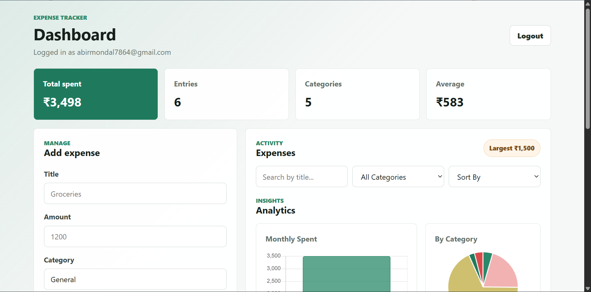
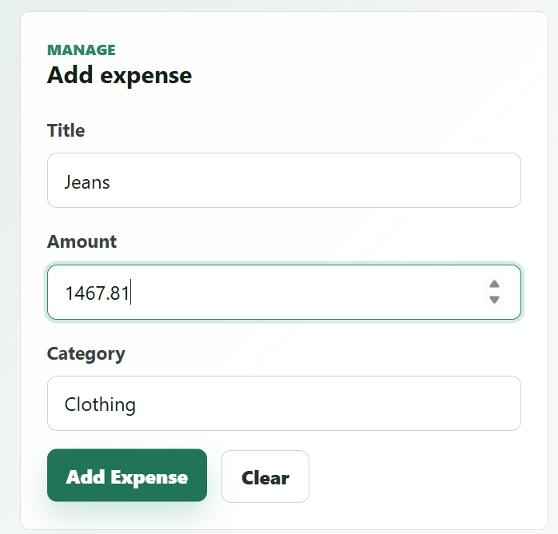
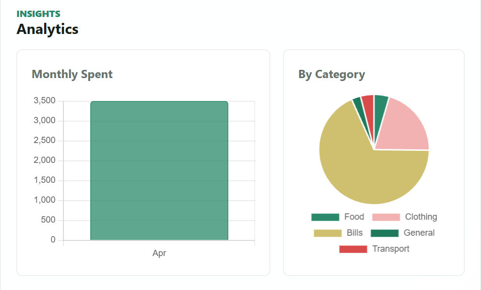
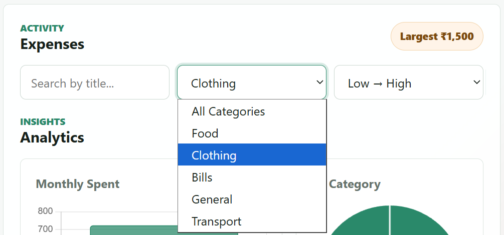

# 💸 Expense Tracker (MERN Stack)

A full-stack Expense Tracker web application built using the MERN stack that helps users manage their daily expenses with powerful analytics and a clean UI.

🔗 **Live App:** https://expense-tracker-xi-blue-21.vercel.app
🔗 **Backend API:** https://expense-tracker-fgcc.onrender.com
🔗 **GitHub Repo:** https://github.com/abirmondal7864/expense-tracker

---

## 🚀 Features

- 🔐 JWT-based Authentication (Register/Login)
- ➕ Add, ✏️ Edit, ❌ Delete Expenses
- 🗂️ Category-wise Expense Management
- 📊 Dashboard with:
  - Total Spending
  - Average Spending
  - Number of Entries
  - Categories Breakdown
- 📈 Analytics (Chart.js)
  - Monthly Spending Trends
  - Category-wise Distribution
- 🔍 Search, Filter & Sort Expenses
- 🔔 Toast Notifications
- ⏳ Loading States & 📭 Empty States
- ⚠️ Delete Confirmation Modal
- ♻️ Reusable UI Components

---

## 🛠️ Tech Stack

**Frontend:**
- React.js
- Axios
- Chart.js
- CSS 

**Backend:**
- Node.js
- Express.js
- MongoDB
- Mongoose
- JWT Authentication

**Deployment:**
- Frontend: Vercel
- Backend: Render

---

## 📸 Screenshots

### Dashboard


### Add Expense


### Analytics


### Filter / Search


---

## 🧠 How It Works (Architecture)


React (Frontend)

↓

Express API (Node.js)

↓

MongoDB Database


- JWT is used for secure authentication
- REST APIs handle CRUD operations
- Chart.js processes and visualizes expense data

---

## ⚙️ Installation & Setup

### 1️⃣ Clone the repository
```bash
git clone https://github.com/abirmondal7864/expense-tracker.git
cd expense-tracker
```
### 2️⃣ Setup Backend
```
cd backend
npm install
```
Create a .env file in /backend:
```
PORT=5000
MONGO_URI=your_mongodb_connection_string
JWT_SECRET=your_secret_key
```
Run backend:
```
npm run dev
```
### 3️⃣ Setup Frontend
```
cd frontend
npm install
```
Create a .env file in /frontend:
```
VITE_API_URL=your_backend_url
```
Run frontend:
```
npm run dev
```

## 🌟 Future Improvements

Budget tracking & alerts

Recurring expenses

Export reports (PDF/CSV)

Dark mode toggle

Mobile app version

## 🎯 What I Learned
Building a full-stack production-ready application
Authentication using JWT
REST API design & integration
Data visualization using charts
Deployment & environment configuration
## 🤝 Contributing

Contributions are welcome! Feel free to fork the repo and submit a pull request.

## 📬 Contact

If you liked this project or want to collaborate:

LinkedIn: https://www.linkedin.com/in/abirmondal7864/
Email: 	abirmondal7864@gmail.com
