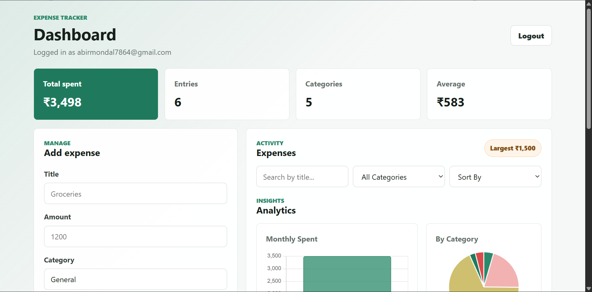
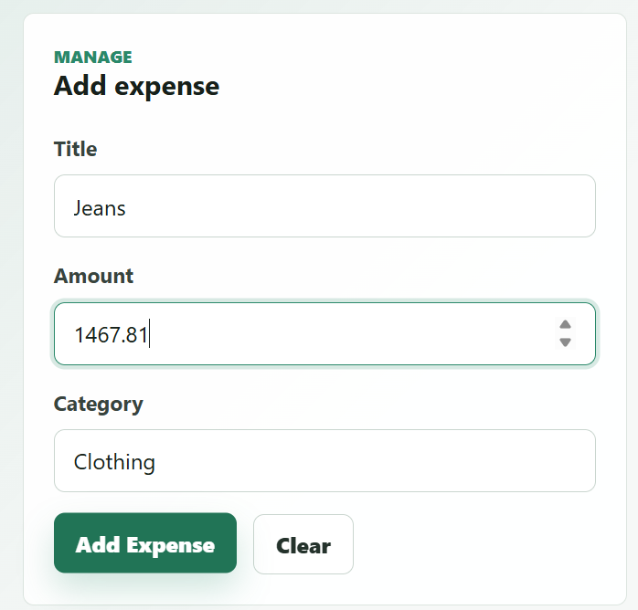
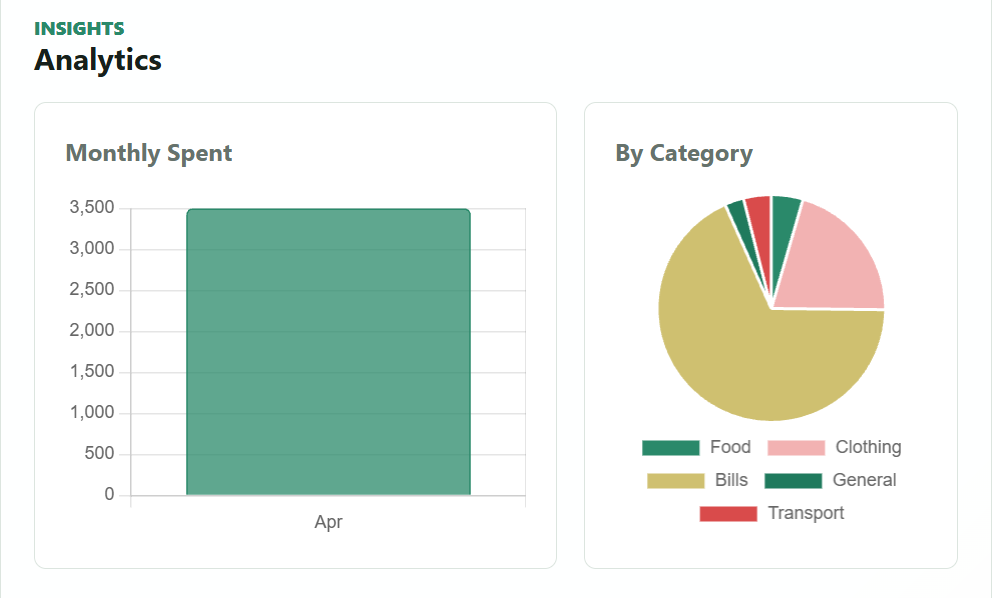
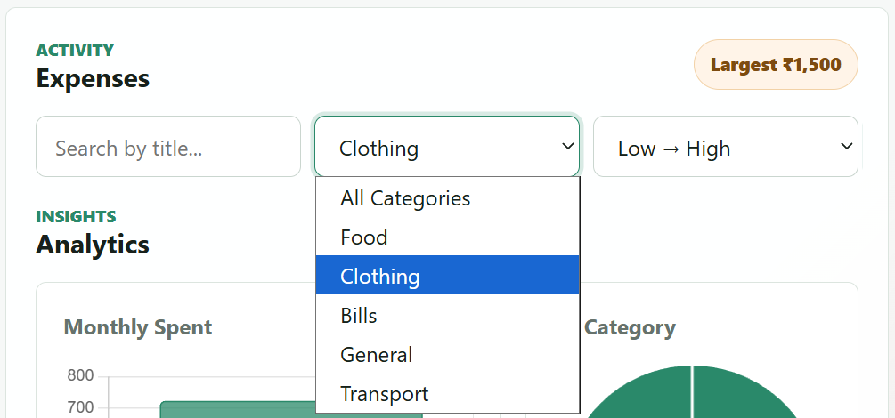

# 💸 Expense Tracker

> A full-stack MERN expense management application with authentication, analytics, filtering, and interactive charts.

[](https://expense-tracker-xi-blue-21.vercel.app)
[](https://expense-tracker-xi-blue-21.vercel.app)
[](https://expense-tracker-fgcc.onrender.com)

## ✨ Features

- 🔐 JWT-based authentication
- ➕ Add, edit, and delete expenses
- 🗂️ Category-based expense management
- 📊 Dashboard with spending summaries
- 📈 Monthly and category-wise analytics
- 🔍 Search, filter, and sort
- 🔔 Toast notifications
- ⏳ Loading and empty states
- ⚠️ Delete confirmation modal
- ♻️ Reusable React components

## 🧩 Architecture

```text
React + Vite
     │
     ▼
Express REST API
     │
     ▼
MongoDB
     ▲
Mongoose
```

## 🛠️ Tech Stack

| Layer | Technologies |
|---|---|
| Frontend | React, Axios, Chart.js, CSS |
| Backend | Node.js, Express.js |
| Database | MongoDB, Mongoose |
| Authentication | JWT |
| Deployment | Vercel, Render |

## 📸 Screenshots

### Dashboard


### Add Expense


### Analytics


### Search & Filter


## 💻 Run Locally

### Backend

```bash
git clone https://github.com/abirmondal7864/expense-tracker.git
cd expense-tracker/backend
npm install
```

Create `.env`:

```env
PORT=5000
MONGO_URI=your_mongodb_connection_string
JWT_SECRET=your_secret_key
```

Run:

```bash
npm run dev
```

### Frontend

```bash
cd ../frontend
npm install
npm run dev
```

Create `.env`:

```env
VITE_API_URL=your_backend_url
```

## 🎯 What This Project Demonstrates

- Full-stack application architecture
- REST API design and integration
- JWT authentication
- MongoDB data modeling with Mongoose
- Data visualization with Chart.js
- Search, filtering, and CRUD workflows
- Frontend/backend deployment

## 🌱 Future Improvements

- Budget tracking and alerts
- Recurring expenses
- PDF/CSV reports
- Dark mode
- Mobile application

## 🤝 Contributing

Contributions are welcome. Fork the repository and open a pull request.

## 🔗 Links

- **Live:** https://expense-tracker-xi-blue-21.vercel.app
- **Backend:** https://expense-tracker-fgcc.onrender.com
- **GitHub:** https://github.com/abirmondal7864/expense-tracker
